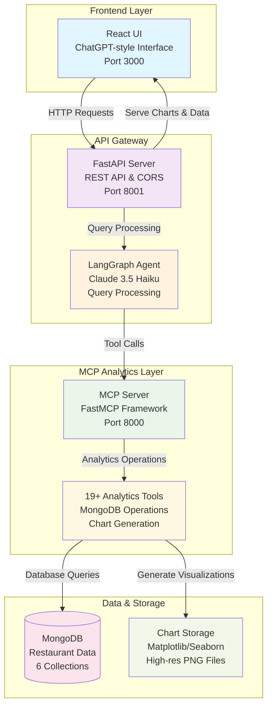

# 🏨 MongoDB Analytics Agent - Restaurant Management Analytics

A comprehensive restaurant analytics platform powered by MongoDB and Model Context Protocol (MCP), featuring intelligent data analysis, automated chart generation, and a modern conversational interface. Built with AI-powered natural language queries and real-time visualization capabilities.


## 🏗️ Architecture Overview

The MongoDB Analytics Agent follows a modern, modular architecture with three main layers:



### Key Components

- **Frontend**: Modern React interface with conversational UI
- **API Gateway**: FastAPI server handling requests and responses
- **AI Agent**: LangGraph-powered agent with Claude 3.5 Haiku LLM
- **MCP Server**: 19+ specialized analytics tools using FastMCP framework
- **Database**: MongoDB with comprehensive restaurant data model
- **Visualization**: Automated chart generation with matplotlib/seaborn

## 🚀 Features

### 🤖 Conversational Analytics
- **Natural Language Queries**: Ask questions in plain English like "Show me daily revenue trends"
- **Context-Aware Responses**: Maintains conversation context and understands follow-up questions
- **Multi-turn Conversations**: Build complex analyses through iterative questioning
- **Smart Query Processing**: AI-powered understanding of restaurant industry terminology

### 📊 Advanced Data Visualization
- **Automated Chart Generation**: Pie charts, bar charts, line graphs, horizontal bars
- **Smart Chart Selection**: AI automatically chooses the best visualization type
- **Time Series Analysis**: Specialized line charts for revenue and order trends
- **Interactive Displays**: High-resolution PNG outputs with professional styling
- **Export Ready**: Right-click to save charts for presentations

### 💰 Revenue Intelligence
- **Daily Revenue Analytics**: Detailed breakdowns with trend analysis
- **Menu Performance**: Revenue by item, category performance, profit analysis
- **Customer Spending**: Segment analysis, lifetime value, spending patterns
- **Order Analytics**: Status distribution, type comparison, completion rates
- **Operational KPIs**: Service efficiency, delivery performance metrics

### 🎨 Modern Interface
- **ChatGPT-style UI**: Familiar conversational interface with message bubbles
- **Real-time Processing**: Live chart generation and instant responses  
- **Responsive Design**: Works seamlessly on desktop, tablet, and mobile
- **Professional Styling**: Restaurant industry color schemes and gradients
- **Text Formatting**: Support for bold, italic, and code formatting in responses

### 🔧 Developer Experience
- **19+ Analytics Tools**: Comprehensive MongoDB operations and specialized analytics
- **FastMCP Integration**: Modern Model Context Protocol implementation
- **REST API**: Well-documented endpoints for external integration
- **Error Handling**: Graceful error management and user feedback

## 🛠️ Technical Stack

### AI & Analytics Engine
- **Python 3.13**: Latest Python with enhanced performance
- **Claude 3.5 Haiku**: Anthropic's advanced language model for query understanding
- **LangGraph**: AI agent orchestration and complex workflow management
- **FastMCP**: Modern Model Context Protocol server implementation
- **MongoDB**: High-performance NoSQL database with aggregation pipelines

### Backend Infrastructure  
- **FastAPI**: High-performance async REST API framework
- **Matplotlib/Seaborn**: Professional data visualization libraries
- **Pydantic**: Data validation and type safety
- **CORS**: Cross-origin resource sharing for web integration
- **Error Handling**: Comprehensive exception management

### Frontend Technologies
- **React 18**: Modern UI framework with hooks and concurrent features
- **CSS3**: Advanced styling with animations, gradients, and responsive design
- **Create React App**: Development tooling and build optimization
- **Fetch API**: Native HTTP client for backend communication
- **Markdown Rendering**: Support for rich text formatting in responses

### Data & Storage
- **MongoDB Collections**: 6 specialized collections for restaurant operations
- **Chart Storage**: File-based PNG storage with unique naming
- **Data Models**: Structured schemas for consistent data handling
- **Aggregation Pipelines**: Complex analytical queries with high performance

## 📁 Project Structure

```
mongodb-agent/
├── 📁 src/                     # Core Application Source
│   ├── 📁 api_server/          # FastAPI Backend
│   │   ├── 📄 fastapi_server.py      # Main API server with CORS
│   │   └── 📁 agent/               # AI Agent Layer
│   │       └── 📄 langgraph_agent.py   # LangGraph agent with Claude
│   ├── 📁 mcp_server/          # MCP Analytics Engine
│   │   ├── 📄 server.py            # FastMCP server entry point
│   │   ├── 📁 tools/               # 19+ Analytics Tools
│   │   │   ├── 📄 mongodb_query.py          # Basic MongoDB operations
│   │   │   ├── 📄 mongodb_aggregate.py      # Complex aggregation pipelines
│   │   │   ├── 📄 generate_chart.py         # Chart generation with matplotlib
│   │   │   ├── 📄 get_revenue_analytics.py  # Revenue analysis tools
│   │   │   ├── 📄 get_menu_performance.py   # Menu insights and analytics
│   │   │   ├── 📄 get_customer_insights.py  # Customer behavior analysis
│   │   │   ├── 📄 get_operational_metrics.py # KPI calculations
│   │   │   └── 📄 ... (12 more specialized tools)
│   │   ├── 📁 models/              # Pydantic data models
│   │   │   └── 📄 data_models.py       # Schema definitions
│   │   └── 📁 utils/               # Database utilities
│   │       └── 📄 db_client.py         # MongoDB connection manager
├── 📁 ui/                      # React Frontend Application
│   ├── 📁 src/
│   │   ├── 📄 App.js               # Main React component (ChatGPT-style UI)
│   │   ├── 📄 App.css              # Enhanced styling with gradients
│   │   ├── 📄 index.js             # React application entry point
│   │   └── 📁 components/          # Reusable UI components
│   │       ├── 📄 ChatContainer.js     # Main chat interface
│   │       ├── 📄 MessageBubble.js     # Individual message display
│   │       └── 📄 AnalyticsCard.js     # Chart display component
│   ├── 📄 package.json             # Node.js dependencies
│   └── 📁 public/                  # Static assets
├── 📁 data/                    # Sample Restaurant Data
│   ├── 📄 customers.json           # Customer records with segments
│   ├── 📄 orders.json              # Order transactions and details
│   ├── 📄 menu_items.json          # Menu catalog with pricing
│   ├── 📄 delivery_details.json    # Delivery logistics
│   ├── 📄 users.json               # System users and staff
│   └── 📄 audit_logs.json          # Activity tracking
├── 📁 charts/                  # Generated Visualizations
├── 📁 mongodb_concepts/        # Learning Materials & Examples
├── 📄 main.py                  # System startup script
├── 📄 requirements.txt         # Python dependencies
├── 📄 pyproject.toml           # Project configuration
├── 📄 TEST_QUESTIONS.md        # Comprehensive testing guide
├── 📄 ARCHITECTURE.md          # Detailed architecture documentation
└── 📄 README.md               # This documentation
```

## 🚀 Quick Start

### Prerequisites
- **Python 3.13+** installed on your system
- **Node.js 18+** and npm for frontend development
- **MongoDB** running locally or remote connection
- **Anthropic API Key** for Claude 3.5 Haiku access
- **Git** for version control

### 1. Clone & Setup Repository
```bash
git clone https://github.com/fnusatvik07/mongodb-agent.git
cd mongodb-agent

# Create and activate Python virtual environment
python -m venv .venv
source .venv/bin/activate  # On Windows: .venv\Scripts\activate

# Install Python dependencies
pip install -r requirements.txt
```

### 2. Environment Configuration
```bash
# Set required environment variables
export ANTHROPIC_API_KEY="your-anthropic-api-key-here"
export MONGODB_URI="mongodb://localhost:27017"  # Optional: defaults to localhost

# Or create a .env file in project root:
echo "ANTHROPIC_API_KEY=your-api-key-here" > .env
echo "MONGODB_URI=mongodb://localhost:27017" >> .env
```

### 3. Database Setup (Optional Sample Data)
```bash
# Import sample restaurant data for testing
mongoimport --db restaurant_management --collection customers --file data/customers.json --jsonArray
mongoimport --db restaurant_management --collection orders --file data/orders.json --jsonArray
mongoimport --db restaurant_management --collection menu_items --file data/menu_items.json --jsonArray
mongoimport --db restaurant_management --collection delivery_details --file data/delivery_details.json --jsonArray
mongoimport --db restaurant_management --collection users --file data/users.json --jsonArray
mongoimport --db restaurant_management --collection audit_logs --file data/audit_logs.json --jsonArray
```

### 4. Frontend Dependencies
```bash
cd ui
npm install
cd ..
```

### 5. Launch All Services
```bash
# Terminal 1: Start MCP Analytics Server (Port 8000)
python src/mcp_server/server.py

# Terminal 2: Start FastAPI Backend (Port 8001)  
python src/api_server/fastapi_server.py

# Terminal 3: Start React Frontend (Port 3000)
cd ui && npm start
```

### 6. Access the Application
🎉 **Open your browser and navigate to: http://localhost:3000**

You should see a ChatGPT-style interface where you can start asking questions like:
- "Show me daily revenue trends"
- "Generate a pie chart of customer segments"  
- "What are the top 5 best-selling menu items?"

## 🔧 Configuration

### Environment Variables
Create a `.env` file in the project root:
```env
# Required: AI Configuration
ANTHROPIC_API_KEY=your-anthropic-api-key-here

# Optional: Database Configuration (defaults provided)
MONGODB_URI=mongodb://localhost:27017
MONGODB_DATABASE=restaurant_management

# Optional: Server Configuration (defaults provided)
MCP_SERVER_PORT=8000
API_SERVER_PORT=8001
UI_PORT=3000

# Optional: Chart Configuration (defaults provided)
CHART_DPI=300
CHART_FORMAT=PNG
CHART_DIRECTORY=./charts
```

### Recent Updates (v2.0)

#### ✨ Major UI/UX Improvements
- **Multiple UI Paradigms**: Evolved from basic → SaaS-style → ChatGPT-style → minimal clean interface
- **Enhanced Text Formatting**: Support for **bold**, *italic*, and `code` formatting in chat responses
- **Responsive Design**: Improved mobile and tablet compatibility
- **Professional Styling**: Restaurant industry color schemes with gradient themes

#### 🔧 Chart Generation Fixes
- **Fixed X-axis Labels**: Resolved issue showing "item1, item2" instead of actual data values
- **Line Chart Improvements**: Fixed time series visualization for daily revenue trends
- **Chart Type Forcing**: Automatic chart type selection for time-based data
- **High-Resolution Output**: 300 DPI PNG generation for professional presentations

#### 🚀 Performance Enhancements  
- **Python 3.13**: Updated to latest Python version with performance improvements
- **Error Handling**: Comprehensive error management and user feedback
- **Data Validation**: Enhanced Pydantic models for type safety
- **Chart Storage**: Optimized file naming and storage system

### MongoDB Collections Schema

#### Customers Collection
```json
{
  "_id": "ObjectId",
  "customer_id": "cust_0001",
  "name": "John Doe", 
  "email": "john@example.com",
  "phone": "+1-555-0123",
  "segment": "vip|premium|standard|new",
  "registration_date": "2024-09-01",
  "total_spent": 1250.00,
  "orders_count": 15,
  "last_order_date": "2024-09-30"
}
```

#### Orders Collection
```json
{
  "_id": "ObjectId",
  "order_id": "order_00001",
  "customer_id": "cust_0001",
  "order_date": "2024-09-15T14:30:00Z",
  "order_type": "dine_in|delivery|takeout",
  "status": "completed|pending|cancelled|refunded",
  "total_amount": 85.50,
  "payment_mode": "upi|card|cash",
  "items": [
    {
      "name": "Margherita Pizza",
      "quantity": 2,
      "unit_price": 18.99,
      "total_price": 37.98
    }
  ],
  "special_instructions": "Extra cheese",
  "delivery_address": "123 Main St, City"
}
```

#### Menu Items Collection
```json
{
  "_id": "ObjectId",
  "item_id": "menu_001",
  "name": "Margherita Pizza",
  "category": "pizza|appetizer|main|dessert|beverage",
  "price": 18.99,
  "cost": 8.50,
  "description": "Fresh tomato, mozzarella, basil",
  "availability": true,
  "allergens": ["dairy", "gluten"],
  "preparation_time": 15
}
```

#### Delivery Details Collection
```json
{
  "_id": "ObjectId",
  "order_id": "order_00001",
  "delivery_person": "Mike Johnson",
  "pickup_time": "2024-09-15T14:45:00Z",
  "delivery_time": "2024-09-15T15:15:00Z",
  "delivery_status": "delivered|in_transit|picked_up",
  "delivery_fee": 4.99,
  "distance_km": 3.2,
  "customer_rating": 5
}
```

#### Users Collection (Staff)
```json
{
  "_id": "ObjectId",
  "user_id": "staff_001",
  "name": "Sarah Wilson",
  "role": "manager|chef|server|delivery",
  "email": "sarah@restaurant.com",
  "hire_date": "2024-01-15",
  "active": true,
  "permissions": ["order_management", "reports"]
}
```

#### Audit Logs Collection
```json
{
  "_id": "ObjectId",
  "timestamp": "2024-09-15T14:30:00Z",
  "user_id": "staff_001",
  "action": "order_created|order_updated|payment_processed",
  "resource": "orders",
  "resource_id": "order_00001",
  "details": "Order status changed to completed"
}
```

## 🛠️ Available Analytics Tools

| Tool Name | Description | Parameters |
|-----------|-------------|------------|
| **mongodb_query** | Basic MongoDB queries | collection, filter, limit |
| **mongodb_aggregate** | Complex aggregation pipelines | collection, pipeline |
| **generate_chart_from_data** | Create visualizations | data_source, chart_type |
| **get_revenue_analytics** | Revenue breakdown analysis | date_range, granularity |
| **get_menu_performance** | Menu item performance | category, time_period |
| **get_customer_insights** | Customer behavior analysis | segment, metrics |
| **get_order_status** | Order status distribution | status, date_range |
| **get_order_types** | Order type analytics | type, period |
| **get_revenue_by_date** | Daily revenue trends | start_date, end_date |
| **get_operational_metrics** | Operational KPIs | metric_type, period |
| **get_customer_segments** | Customer segmentation | criteria |
| **search_orders_by_criteria** | Advanced order search | multiple filters |
| **get_menu_revenue** | Menu revenue analysis | category, period |
| **quick_stats** | Quick statistics overview | metric_set |
| **get_data_range** | Data availability check | collection |
| **mongodb_describe_collection** | Schema information | collection_name |
| **mongodb_get_collections** | List all collections | - |
| **mongodb_insert** | Insert new records | collection, data |
| **mongodb_update** | Update existing records | collection, filter, update |

## 💬 Usage Examples

### Revenue Analysis
```
"Show me the daily revenue trends for September 2024"
"Generate a line chart of daily revenue trends"
"What was the total revenue from September 15-30, 2024?"
"Compare revenue between delivery and dine-in orders"
"Create a bar chart showing revenue by order type"
```

### Menu Performance
```
"What are the top 10 best-selling menu items?"
"Show me menu performance by category"  
"Generate a pie chart of menu item revenue distribution"
"Which items have the highest profit margins?"
"Create a horizontal bar chart of menu item popularity"
```

### Customer Analytics
```
"Show me customer segments breakdown"
"Generate a pie chart of customer segments"
"Who are the top 5 customers by total spending?"
"What's the average order value by customer segment?"
"Create a bar chart showing top customers by spending"
```

### Operational Insights
```
"Show me order status distribution for this month"
"Generate a pie chart of order status distribution"
"What's the most popular payment method?"
"Display delivery performance metrics"
"Show me peak ordering hours"
```

### Advanced Analytics
```
"Find customers with unusual ordering patterns"
"Show seasonal trends in ordering behavior"
"Calculate key operational metrics for September 2024"
"Which combinations of menu items are ordered together?"
"Provide a business summary for September 2024"
```

## 🎨 UI Features

### Chat Interface
- **Message History**: Persistent conversation history
- **Typing Indicators**: Real-time response feedback
- **Auto-scroll**: Automatic scrolling to latest messages
- **Error Handling**: Graceful error message display

### Chart Display
- **Inline Charts**: Charts appear directly in chat
- **High Resolution**: 300 DPI chart generation
- **Interactive Hover**: Enhanced chart interactions
- **Export Ready**: Right-click to save charts

### Tools Panel
- **Tool Discovery**: Browse all available analytics tools
- **Parameter Info**: See required parameters for each tool
- **Description View**: Understand tool capabilities
- **Quick Access**: Toggle panel visibility

### Responsive Design
- **Desktop Optimized**: Full-featured desktop experience
- **Tablet Support**: Touch-friendly tablet interface
- **Mobile Ready**: Responsive mobile layout
- **Cross-browser**: Works on Chrome, Firefox, Safari, Edge

## 🔍 API Reference

### FastAPI Endpoints

#### Query Endpoint
```http
POST /query
Content-Type: application/json

{
  "query": "string",
  "generate_chart": boolean,
  "chart_type": "auto|pie|bar|line"
}
```

#### Response Format
```json
{
  "success": boolean,
  "response": "string",
  "tool_calls": number,
  "message_count": number,
  "tools_used": ["string"],
  "chart_path": "string|null",
  "chart_title": "string|null",
  "error": "string|null"
}
```

#### Tools Endpoint
```http
GET /tools
```

```json
{
  "tools": [
    {
      "name": "string",
      "description": "string", 
      "parameters": ["string"]
    }
  ],
  "total_count": number
}
```

#### Charts Endpoint
```http
GET /charts/{filename}
```

### MCP Protocol
The system implements the Model Context Protocol for tool communication:
- **Tool Discovery**: Automatic tool registration
- **Type Safety**: Pydantic model validation
- **Error Handling**: Structured error responses
- **Streaming**: Real-time response streaming

## 🧪 Testing & Development

### Comprehensive Test Suite
The project includes `TEST_QUESTIONS.md` with 50+ test scenarios covering:

- **Data Exploration**: Collection discovery, schema analysis, data ranges
- **Revenue Analytics**: Totals, trends, breakdowns by various dimensions  
- **Customer Analysis**: Segments, behavior patterns, spending analysis
- **Menu Performance**: Popular items, category analysis, profit margins
- **Chart Generation**: All chart types with various data combinations
- **Advanced Queries**: Complex filters, aggregations, business intelligence

### API Testing Examples
```bash
# Simple analytics query
curl -X POST "http://localhost:8001/query" \
  -H "Content-Type: application/json" \
  -d '{"query": "Show me daily revenue trends"}'

# Query with chart generation  
curl -X POST "http://localhost:8001/query" \
  -H "Content-Type: application/json" \
  -d '{
    "query": "Generate a pie chart of customer segments",
    "generate_chart": true
  }'

# Get available tools
curl "http://localhost:8001/tools"
```

### Development Workflow
```bash
# Run backend tests
python -m pytest tests/ -v

# Format code
black src/ --line-length 88
prettier --write ui/src/

# Check types  
mypy src/

# Lint code
flake8 src/
eslint ui/src/
```

## 🚀 Deployment

### Docker Deployment
```bash
# Build images
docker-compose build

# Start services
docker-compose up -d

# View logs
docker-compose logs -f
```

### Production Environment
1. **Database**: Use MongoDB Atlas or dedicated MongoDB server
2. **API Keys**: Secure Anthropic API key management
3. **HTTPS**: Enable SSL/TLS certificates
4. **Monitoring**: Add application monitoring and alerts
5. **Scaling**: Consider horizontal scaling for high traffic

## 🤝 Contributing

We welcome contributions! Please follow these steps:

1. **Fork** the repository
2. **Create** a feature branch (`git checkout -b feature/amazing-feature`)
3. **Commit** your changes (`git commit -m 'Add amazing feature'`)
4. **Push** to the branch (`git push origin feature/amazing-feature`)
5. **Open** a Pull Request

### Development Guidelines
- Follow Python PEP 8 style guide
- Use TypeScript for new frontend components
- Write comprehensive tests for new features
- Update documentation for API changes
- Ensure responsive design compliance

## 📄 License

This project is licensed under the MIT License - see the [LICENSE](LICENSE) file for details.

## 🙏 Acknowledgments

- **Anthropic** - Claude AI language model
- **FastMCP** - Model Context Protocol framework  
- **MongoDB** - Database platform
- **React** - Frontend framework
- **FastAPI** - Backend framework
- **Matplotlib/Seaborn** - Data visualization libraries

## 📞 Support

- **Issues**: [GitHub Issues](https://github.com/fnusatvik07/mongodb-agent/issues)
- **Discussions**: [GitHub Discussions](https://github.com/fnusatvik07/mongodb-agent/discussions)
- **Email**: support@mongodb-agent.com

## 📄 License

This project is licensed under the **MIT License** - see the [LICENSE](LICENSE) file for details.

## 🙏 Acknowledgments

- **Anthropic** - Claude 3.5 Haiku language model for intelligent query processing
- **FastMCP** - Modern Model Context Protocol framework for tool integration
- **MongoDB** - High-performance NoSQL database platform  
- **React Team** - Modern UI framework and ecosystem
- **FastAPI** - High-performance Python web framework
- **Matplotlib & Seaborn** - Professional data visualization libraries

## 📞 Support & Community

- **Issues**: [GitHub Issues](https://github.com/fnusatvik07/mongodb-agent/issues) - Bug reports and feature requests
- **Discussions**: [GitHub Discussions](https://github.com/fnusatvik07/mongodb-agent/discussions) - Questions and community help
- **Documentation**: Comprehensive guides in `ARCHITECTURE.md` and `TEST_QUESTIONS.md`
- **Contributing**: See contributing guidelines below for development participation

## 🤝 Contributing

We welcome contributions from the community! Here's how to get involved:

### Development Process
1. **Fork** the repository on GitHub
2. **Clone** your fork locally: `git clone https://github.com/YOUR-USERNAME/mongodb-agent.git`
3. **Create** a feature branch: `git checkout -b feature/amazing-new-feature`
4. **Develop** your changes with proper testing
5. **Commit** with clear messages: `git commit -m 'Add amazing new feature'`
6. **Push** to your fork: `git push origin feature/amazing-new-feature`  
7. **Create** a Pull Request with detailed description

### Contribution Guidelines
- **Code Style**: Follow PEP 8 for Python, Prettier for JavaScript/React
- **Testing**: Add tests for new features and maintain >90% coverage
- **Documentation**: Update README and add inline code documentation
- **Type Safety**: Use type hints in Python, TypeScript for complex frontend features
- **Performance**: Ensure changes don't degrade query or chart generation performance

## 🔮 Roadmap

### Version 2.1 (Q1 2025)
- [ ] **Real-time Analytics**: WebSocket integration for live data updates
- [ ] **Advanced Filters**: Date ranges, custom field filtering in UI
- [ ] **Export Capabilities**: PDF reports, Excel data export
- [ ] **Custom Dashboards**: User-configurable analytics dashboards
- [ ] **Mobile App**: React Native mobile application

### Version 2.2 (Q2 2025)  
- [ ] **Multi-tenant Support**: Restaurant chain management
- [ ] **Role-based Access**: Staff permissions and data access controls
- [ ] **API Rate Limiting**: Enhanced security and performance controls
- [ ] **Caching Layer**: Redis integration for improved query performance
- [ ] **Audit Trail**: Enhanced logging and compliance features

### Version 3.0 (Q3 2025)
- [ ] **Machine Learning**: Predictive analytics for sales forecasting
- [ ] **Advanced Algorithms**: Customer lifetime value, churn prediction
- [ ] **Third-party Integrations**: POS systems, delivery platforms
- [ ] **Voice Interface**: Voice-activated analytics queries
- [ ] **Business Intelligence**: Advanced reporting and insights engine

---

<div align="center">

**🍕 Built with ❤️ for the restaurant industry**

**Transform your restaurant data into actionable insights with AI-powered analytics**

[⭐ Star this repo](https://github.com/fnusatvik07/mongodb-agent) | [🐛 Report Bug](https://github.com/fnusatvik07/mongodb-agent/issues) | [💡 Request Feature](https://github.com/fnusatvik07/mongodb-agent/issues) | [📖 Documentation](https://github.com/fnusatvik07/mongodb-agent/wiki)

**Version 2.0** | **Python 3.13** | **React 18** | **MongoDB 7.0** | **Claude 3.5 Haiku**

</div>