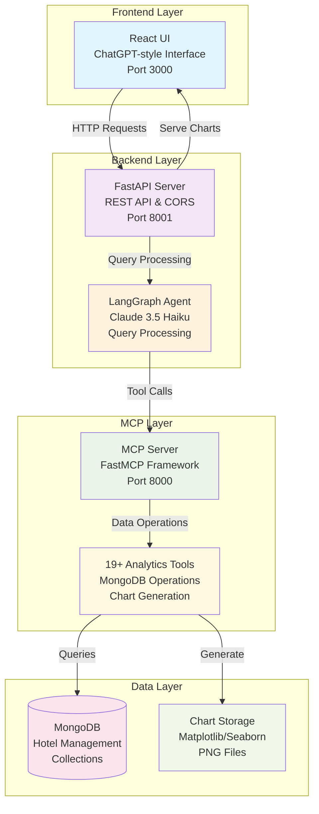

# 🏨 X-Hotel Analytics - MongoDB MCP Agent

A comprehensive hotel analytics platform powered by MongoDB and Model Context Protocol (MCP), featuring intelligent data analysis, automated chart generation, and a modern web interface.


## 🏗️ Architecture Overview



## 🚀 Features

### 🎯 Core Analytics
- **Revenue Analytics**: Daily, weekly, monthly revenue breakdowns
- **Menu Performance**: Top-selling items, revenue by menu category
- **Customer Insights**: Segment analysis, spending patterns, loyalty metrics
- **Order Analytics**: Status tracking, type distribution, trends
- **Operational Metrics**: Delivery performance, service efficiency

### 📊 Data Visualization
- **Automated Chart Generation**: Pie charts, bar charts, line graphs, horizontal bars
- **Smart Chart Selection**: AI-powered chart type recommendations
- **Interactive Displays**: Hover effects, zoom capabilities
- **Export Ready**: High-resolution PNG outputs

### 🤖 Intelligent Interface
- **Natural Language Queries**: Ask questions in plain English
- **Context-Aware Responses**: Understands hotel industry terminology
- **Multi-turn Conversations**: Maintains context across queries
- **Tools Exploration**: View all 19+ available analytics tools

### 🎨 Modern UI/UX
- **ChatGPT-style Interface**: Familiar chat-based interaction
- **Responsive Design**: Works on desktop, tablet, and mobile
- **Real-time Updates**: Live chart generation and display
- **Professional Styling**: Hotel industry color schemes and branding

## 🛠️ Technical Stack

### Backend Technologies
- **Python 3.11+**: Core backend language
- **FastAPI**: High-performance REST API framework
- **LangGraph**: AI agent orchestration and workflow management
- **FastMCP**: Model Context Protocol server implementation
- **Anthropic Claude 3.5 Haiku**: Large language model for query understanding
- **MongoDB**: NoSQL database for hotel data storage
- **Matplotlib/Seaborn**: Chart generation and data visualization

### Frontend Technologies
- **React 18**: Modern UI framework
- **CSS3**: Advanced styling with animations and gradients
- **Create React App**: Development and build tooling
- **Fetch API**: HTTP client for backend communication

### Infrastructure
- **CORS**: Cross-origin resource sharing configuration
- **File Serving**: Static chart file hosting
- **Error Handling**: Comprehensive error management
- **Logging**: Detailed application monitoring

## 📁 Project Structure

```
mongodb-agent/
├── 📁 src/mcp_server/          # MCP Server Implementation
│   ├── 📄 server.py            # FastMCP server entry point
│   ├── 📁 tools/               # 19+ Analytics Tools
│   │   ├── 📄 mongodb_query.py          # Basic MongoDB queries
│   │   ├── 📄 mongodb_aggregate.py      # Complex aggregation pipelines
│   │   ├── 📄 generate_chart.py         # Chart generation tool
│   │   ├── 📄 get_revenue_analytics.py  # Revenue analysis
│   │   ├── 📄 get_menu_performance.py   # Menu insights
│   │   ├── 📄 get_customer_insights.py  # Customer analytics
│   │   └── 📄 ... (16 more tools)
│   ├── 📁 models/              # Data models and schemas
│   └── 📁 utils/               # Database utilities
├── 📁 agent/                   # AI Agent Layer
│   └── 📄 langgraph_agent.py   # LangGraph agent implementation
├── 📁 ui/                      # React Frontend
│   ├── 📁 src/
│   │   ├── 📄 App.js           # Main React component
│   │   ├── 📄 App.css          # Enhanced UI styles
│   │   └── 📄 index.js         # React entry point
│   └── 📄 package.json         # Node.js dependencies
├── 📁 data/                    # Sample Hotel Data
│   ├── 📄 customers.json       # Customer records
│   ├── 📄 orders.json          # Order transactions
│   ├── 📄 menu_items.json      # Menu catalog
│   └── 📄 ... (more datasets)
├── 📁 charts/                  # Generated Visualizations
├── 📄 fastapi_server.py        # FastAPI REST API server
├── 📄 requirements.txt         # Python dependencies
└── 📄 README.md               # This documentation
```

## 🚀 Quick Start

### Prerequisites
- **Python 3.11+** installed
- **Node.js 16+** and npm
- **MongoDB** running locally or remotely
- **Git** for version control

### 1. Clone the Repository
```bash
git clone https://github.com/fnusatvik07/mongodb-agent.git
cd mongodb-agent
```

### 2. Backend Setup
```bash
# Create virtual environment
python -m venv .venv

# Activate virtual environment
source .venv/bin/activate  # On Windows: .venv\Scripts\activate

# Install Python dependencies
pip install -r requirements.txt

# Set up environment variables
export ANTHROPIC_API_KEY="your-anthropic-api-key"
export MONGODB_URI="mongodb://localhost:27017"
```

### 3. Database Setup
```bash
# Import sample data (optional)
mongoimport --db hotel_management --collection customers --file data/customers.json --jsonArray
mongoimport --db hotel_management --collection orders --file data/orders.json --jsonArray
mongoimport --db hotel_management --collection menu_items --file data/menu_items.json --jsonArray
```

### 4. Frontend Setup
```bash
cd ui
npm install
```

### 5. Start All Services
```bash
# Terminal 1: Start MCP Server
python src/mcp_server/server.py

# Terminal 2: Start FastAPI Backend
python fastapi_server.py

# Terminal 3: Start React Frontend
cd ui && npm start
```

### 6. Access the Application
Open your browser and navigate to: **http://localhost:3000**

## 🔧 Configuration

### Environment Variables
Create a `.env` file in the project root:
```env
# AI Configuration
ANTHROPIC_API_KEY=your-anthropic-api-key-here

# Database Configuration
MONGODB_URI=mongodb://localhost:27017
MONGODB_DATABASE=hotel_management

# Server Configuration
MCP_SERVER_PORT=8000
API_SERVER_PORT=8001
UI_PORT=3000

# Chart Configuration
CHART_DPI=300
CHART_FORMAT=PNG
CHART_DIRECTORY=./charts
```

### MongoDB Collections Schema

#### Customers Collection
```json
{
  "_id": "ObjectId",
  "customer_id": "string",
  "name": "string", 
  "email": "string",
  "segment": "vip|standard|premium",
  "total_spent": "number",
  "orders_count": "number"
}
```

#### Orders Collection
```json
{
  "_id": "ObjectId",
  "order_id": "string",
  "customer_id": "string",
  "order_date": "YYYY-MM-DD",
  "order_time": "HH:MM:SS",
  "order_type": "dine-in|delivery|takeout",
  "status": "completed|pending|cancelled",
  "total_amount": "number",
  "items": [
    {
      "name": "string",
      "quantity": "number", 
      "price": "number"
    }
  ]
}
```

#### Menu Items Collection
```json
{
  "_id": "ObjectId",
  "item_id": "string",
  "name": "string",
  "category": "string",
  "price": "number",
  "description": "string",
  "availability": "boolean"
}
```

## 🛠️ Available Analytics Tools

| Tool Name | Description | Parameters |
|-----------|-------------|------------|
| **mongodb_query** | Basic MongoDB queries | collection, filter, limit |
| **mongodb_aggregate** | Complex aggregation pipelines | collection, pipeline |
| **generate_chart_from_data** | Create visualizations | data_source, chart_type |
| **get_revenue_analytics** | Revenue breakdown analysis | date_range, granularity |
| **get_menu_performance** | Menu item performance | category, time_period |
| **get_customer_insights** | Customer behavior analysis | segment, metrics |
| **get_order_status** | Order status distribution | status, date_range |
| **get_order_types** | Order type analytics | type, period |
| **get_revenue_by_date** | Daily revenue trends | start_date, end_date |
| **get_operational_metrics** | Operational KPIs | metric_type, period |
| **get_customer_segments** | Customer segmentation | criteria |
| **search_orders_by_criteria** | Advanced order search | multiple filters |
| **get_menu_revenue** | Menu revenue analysis | category, period |
| **quick_stats** | Quick statistics overview | metric_set |
| **get_data_range** | Data availability check | collection |
| **mongodb_describe_collection** | Schema information | collection_name |
| **mongodb_get_collections** | List all collections | - |
| **mongodb_insert** | Insert new records | collection, data |
| **mongodb_update** | Update existing records | collection, filter, update |

## 💬 Usage Examples

### Revenue Analysis
```
"Show me the revenue breakdown for this month"
"What's the daily revenue trend for the last 30 days?"
"Generate a pie chart showing revenue by order type"
```

### Menu Performance
```
"What are the top 10 best-selling menu items?"
"Show me menu performance by category"
"Which items have the highest revenue per order?"
```

### Customer Insights
```
"Analyze customer spending patterns by segment"
"Show me VIP customer behavior trends"
"What's the average order value by customer type?"
```

### Operational Metrics
```
"Display order status distribution for today"
"Show delivery vs dine-in performance"
"What are our peak ordering hours?"
```

## 🎨 UI Features

### Chat Interface
- **Message History**: Persistent conversation history
- **Typing Indicators**: Real-time response feedback
- **Auto-scroll**: Automatic scrolling to latest messages
- **Error Handling**: Graceful error message display

### Chart Display
- **Inline Charts**: Charts appear directly in chat
- **High Resolution**: 300 DPI chart generation
- **Interactive Hover**: Enhanced chart interactions
- **Export Ready**: Right-click to save charts

### Tools Panel
- **Tool Discovery**: Browse all available analytics tools
- **Parameter Info**: See required parameters for each tool
- **Description View**: Understand tool capabilities
- **Quick Access**: Toggle panel visibility

### Responsive Design
- **Desktop Optimized**: Full-featured desktop experience
- **Tablet Support**: Touch-friendly tablet interface
- **Mobile Ready**: Responsive mobile layout
- **Cross-browser**: Works on Chrome, Firefox, Safari, Edge

## 🔍 API Reference

### FastAPI Endpoints

#### Query Endpoint
```http
POST /query
Content-Type: application/json

{
  "query": "string",
  "generate_chart": boolean,
  "chart_type": "auto|pie|bar|line"
}
```

#### Response Format
```json
{
  "success": boolean,
  "response": "string",
  "tool_calls": number,
  "message_count": number,
  "tools_used": ["string"],
  "chart_path": "string|null",
  "chart_title": "string|null",
  "error": "string|null"
}
```

#### Tools Endpoint
```http
GET /tools
```

```json
{
  "tools": [
    {
      "name": "string",
      "description": "string", 
      "parameters": ["string"]
    }
  ],
  "total_count": number
}
```

#### Charts Endpoint
```http
GET /charts/{filename}
```

### MCP Protocol
The system implements the Model Context Protocol for tool communication:
- **Tool Discovery**: Automatic tool registration
- **Type Safety**: Pydantic model validation
- **Error Handling**: Structured error responses
- **Streaming**: Real-time response streaming

## 🧪 Development

### Adding New Tools
1. Create a new tool file in `src/mcp_server/tools/`
2. Implement the `register_tool` function
3. Add tool import in `server.py`
4. Update documentation

Example tool structure:
```python
from typing import Dict, Any
from fastmcp import FastMCP

def register_tool(mcp: FastMCP, db):
    @mcp.tool()
    def your_tool_name(param1: str, param2: int = 10) -> Dict[str, Any]:
        """Tool description for the AI agent
        
        Args:
            param1: Description of parameter 1
            param2: Description of parameter 2
            
        Returns:
            Dictionary with analysis results
        """
        # Tool implementation
        return {"result": "analysis_data"}
```

### Running Tests
```bash
# Backend tests
python -m pytest tests/

# Frontend tests  
cd ui && npm test

# Integration tests
python -m pytest tests/integration/
```

### Code Quality
```bash
# Format code
black src/ agent/
prettier --write ui/src/

# Lint code  
flake8 src/ agent/
eslint ui/src/

# Type checking
mypy src/ agent/
```

## 🚀 Deployment

### Docker Deployment
```bash
# Build images
docker-compose build

# Start services
docker-compose up -d

# View logs
docker-compose logs -f
```

### Production Environment
1. **Database**: Use MongoDB Atlas or dedicated MongoDB server
2. **API Keys**: Secure Anthropic API key management
3. **HTTPS**: Enable SSL/TLS certificates
4. **Monitoring**: Add application monitoring and alerts
5. **Scaling**: Consider horizontal scaling for high traffic

## 🤝 Contributing

We welcome contributions! Please follow these steps:

1. **Fork** the repository
2. **Create** a feature branch (`git checkout -b feature/amazing-feature`)
3. **Commit** your changes (`git commit -m 'Add amazing feature'`)
4. **Push** to the branch (`git push origin feature/amazing-feature`)
5. **Open** a Pull Request

### Development Guidelines
- Follow Python PEP 8 style guide
- Use TypeScript for new frontend components
- Write comprehensive tests for new features
- Update documentation for API changes
- Ensure responsive design compliance

## 📄 License

This project is licensed under the MIT License - see the [LICENSE](LICENSE) file for details.

## 🙏 Acknowledgments

- **Anthropic** - Claude AI language model
- **FastMCP** - Model Context Protocol framework  
- **MongoDB** - Database platform
- **React** - Frontend framework
- **FastAPI** - Backend framework
- **Matplotlib/Seaborn** - Data visualization libraries

## 📞 Support

- **Issues**: [GitHub Issues](https://github.com/fnusatvik07/mongodb-agent/issues)
- **Discussions**: [GitHub Discussions](https://github.com/fnusatvik07/mongodb-agent/discussions)
- **Email**: support@mongodb-agent.com

## 🔮 Roadmap

### Version 1.1
- [ ] Real-time data streaming
- [ ] Advanced filtering options
- [ ] Export to PDF/Excel
- [ ] Custom dashboard creation

### Version 1.2  
- [ ] Multi-tenant support
- [ ] Role-based access control
- [ ] API rate limiting
- [ ] Performance optimization

### Version 2.0
- [ ] Machine learning predictions
- [ ] Advanced analytics algorithms
- [ ] Mobile app development
- [ ] Third-party integrations

---

<div align="center">

**Built with ❤️ for the hotel industry**

[⭐ Star this repo](https://github.com/fnusatvik07/mongodb-agent) | [🐛 Report Bug](https://github.com/fnusatvik07/mongodb-agent/issues) | [💡 Request Feature](https://github.com/fnusatvik07/mongodb-agent/issues)

</div>
- `delivery_details`: Delivery logistics and tracking
- `users`: System users and staff information
- `audit_logs`: System activity and audit trails

## Core Files

- `main.py`: System startup and management
- `fastapi_server.py`: REST API server with agent integration
- `langgraph_agent.py`: LangGraph agent with Groq LLM
- `src/mcp_server/`: FastMCP server with MongoDB tools
- `helpers/`: Utility functions and setup scripts

## Environment Variables

- `GROQ_API_KEY`: Required for LLM functionality
- `MONGODB_URI`: Optional, defaults to localhost:27017
- `DATABASE_NAME`: Optional, defaults to hotel_management